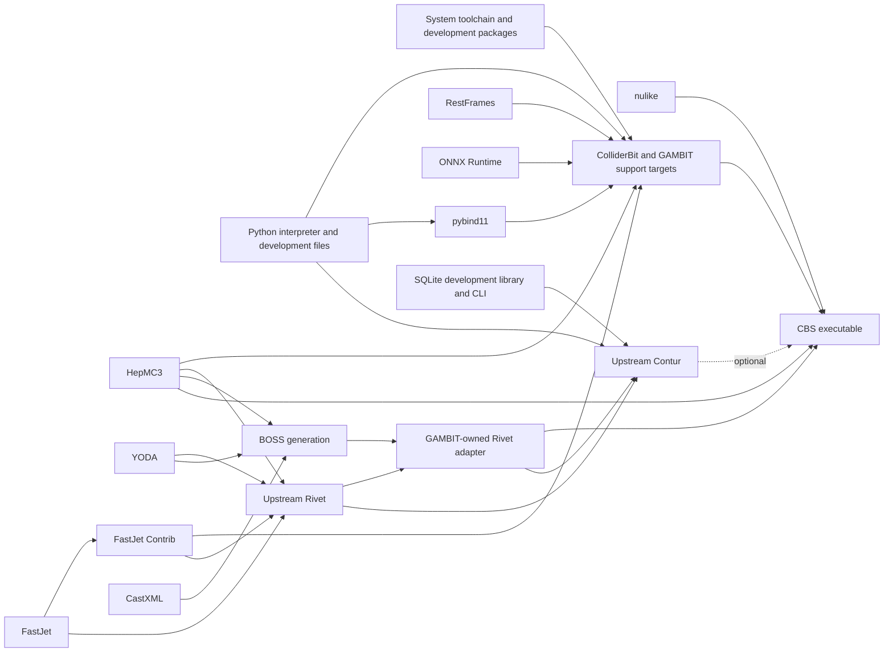

# GAMBIT CMake Preset Architecture and Engineering Standard

- Status: Normative engineering standard
- Version: 1.0
- Scope: All public GAMBIT configure, build, test, package, and workflow presets

## 1. Purpose

This document defines how GAMBIT presets and the CMake code supporting them
must be designed, reviewed, tested, and maintained. Its goals are to make every
supported build profile:

- reproducible and traceable;
- isolated from every other preset;
- represented by an explicit dependency graph;
- compatible with normal non-preset GAMBIT builds;
- based on unmodified upstream packages;
- diagnosable before an expensive build starts; and
- maintainable using modern, target-based CMake.

The standard applies to new presets immediately. Existing build logic that does
not yet satisfy it is migration debt and must not be copied into a new preset.

The words **MUST**, **MUST NOT**, **SHOULD**, **SHOULD NOT**, and **MAY** are
normative requirements.

## 2. Architectural principles

### 2.1 A preset declares a build contract

A preset is not a script that repairs a machine or modifies a dependency. It is
a versioned declaration of:

1. the GAMBIT profile to build;
2. the toolchain to use;
3. the required and optional capabilities;
4. the final CMake target or targets;
5. the dependency closure of those targets; and
6. the validation and test obligations for the result.

Running the same preset from the same source revision with the same declared
inputs must resolve the same target graph. Machine-specific paths may differ,
but all resolved paths and versions must be reported.

### 2.2 Dependencies are the organising principle

CMake target dependencies, not command ordering or the state left by an earlier
build, must determine the build sequence. If target `A` consumes a file or
library produced by target `B`, the graph must contain an explicit dependency
from `A` to `B`.

Dependencies must be attached at the level at which the generated artefact is
consumed. A project-level dependency is insufficient when an
`ExternalProject_Add` step consumes output from another external project; the
step itself must have the corresponding step dependency.

### 2.3 Presets select; package modules implement

`CMakePresets.json` selects cache values, toolchains, binary directories, and
top-level build targets. It must not contain package versions, download URLs,
patch logic, platform shell commands, or dependency implementation details.

Package versions and construction rules belong to dedicated CMake package
modules. Native GAMBIT target definitions belong to their normal module CMake
files. Preset orchestration may connect existing targets, but must not duplicate
their implementation.

### 2.4 Normal GAMBIT builds remain valid

Ordinary non-preset configuration must continue to work. Preset-specific
orchestration must be activated by an explicit cache identity such as
`CBS_BUILD_PRESET`; it must not change the semantics of an ordinary
`cmake <source>` build.

### 2.5 No modification of downloaded source

New preset work must not patch, rewrite, copy over, or edit downloaded package
source. This prohibition includes:

- `PATCH_COMMAND` for a new dependency integration;
- `patch`, `sed -i`, or equivalent source-tree mutation;
- generated diffs applied during configure or build;
- editing generated Makefiles inside an external source tree;
- compiler options whose purpose is to conceal a missing include or another
  source defect; and
- relying on a previously patched source directory.

If an upstream package is not compatible, the supported responses are, in
order:

1. use a fixed upstream release or immutable fixed commit;
2. submit the fix upstream and consume the resulting upstream revision;
3. implement a GAMBIT-owned adapter outside the downloaded source tree; or
4. mark the package unavailable for that toolchain with a precise diagnostic.

Silently changing an archive checksum to accept unexplained new content is not
an acceptable fix.

## 3. Ownership boundaries

GAMBIT build logic is divided into four layers. A change must be placed in the
layer that owns the fact being changed.

| Layer | Owns | Must not own |
|---|---|---|
| Preset | Profile, toolchain choice, feature policy, binary directory, final targets | Package source changes, package versions, link implementation |
| Native GAMBIT CMake | GAMBIT targets, target properties, feature targets, target dependency graph | Machine provisioning, downloaded source fixes |
| `contrib` package module | Verified download, supported configure options, build, install, imported target | BOSS interfaces, GAMBIT backend API changes, source patches |
| Backend/BOSS integration | Backend discovery, generated frontend/wrapper API, GAMBIT-owned adapter target | General third-party bug fixes, arbitrary source mutation |

System provisioning is outside CMake. A preset may detect a missing package and
explain how to provide it, but it must not run `apt`, `brew`, `pip`, `conda`, or
another package manager automatically.

## 4. Preset taxonomy and naming

Each public build is the product of three independent dimensions:

```text
profile × toolchain × build mode
```

- **Profile** selects GAMBIT capabilities and final targets, for example `cbs`
  or `gambit`.
- **Toolchain** selects the compiler strategy, for example `system` or
  `upstream-llvm`.
- **Build mode** selects `Release`, `Debug`, or another supported configuration.

Public preset names should follow these forms:

```text
<profile>                    # default/system toolchain
<profile>-<toolchain>        # explicit alternative toolchain
<profile>-<toolchain>-debug  # explicit non-default build mode
```

Hidden presets must end in `-base` or another clearly internal suffix. Public
configure and build presets should use the same name.

Examples:

```text
cbs
cbs-llvm
gambit
gambit-llvm
gambit-llvm-debug
```

Preset-owned cache variables must use a profile-specific namespace. Generic
variables such as `WITH_HDF5` remain native GAMBIT options; orchestration state
uses names such as `CBS_BUILD_PRESET` and `CBS_AUTO_DETECT_ROOT`.

Public contracts belong in the tracked `CMakePresets.json`. Developers MAY use
an untracked `CMakeUserPresets.json` for local paths or experiments, but no CI
job, documented workflow, or package rule may require it. Tracked presets must
not contain a maintainer's absolute filesystem paths.

### 4.1 Registry and lifecycle

Every public preset must have a registry entry containing its profile,
toolchain policy, supported platforms, maturity, maintainer role, and CI job.
Maturity is one of:

- **experimental**: interface may change and CI may be advisory;
- **supported**: clean CI is required and changes follow this standard; or
- **deprecated**: replacement and removal release are documented.

The current registry is:

| Preset | Profile | Toolchain | Maturity | Standard status |
|---|---|---|---|---|
| `cbs` | CBS | System/user-selected | Supported | Migration required |
| `cbs-llvm` | CBS | Upstream LLVM plus validated Fortran | Supported | Migration required |
| `gambit` | Full GAMBIT | System/user-selected | Planned | Not implemented |
| `gambit-llvm` | Full GAMBIT | Upstream LLVM plus validated Fortran | Planned | Not implemented |

A change to a supported preset's feature policy, toolchain policy, target
closure, dependency source, or minimum CMake version is a build-contract change
and must update its documentation, validation, trace manifest, and CI coverage.

## 5. Isolation requirements

### 5.1 One binary directory per public configure preset

Every public configure preset MUST have a unique binary directory. The target
layout is:

```text
build/presets/<preset-name>/
```

For example:

```text
build/presets/cbs/
build/presets/cbs-llvm/
build/presets/gambit/
build/presets/gambit-llvm/
```

Two presets must not share `CMakeCache.txt`, compiler identification results,
ExternalProject stamps, generated BOSS output, or generated GAMBIT headers.
Switching presets must not require `--fresh` merely to change compiler family.
`--fresh` remains useful for resetting one preset after a cache-affecting
change.

If two presets intentionally share a downloaded archive cache, that cache must
contain immutable, checksum-verified archives only. Sources, build trees,
install prefixes, and stamps must remain preset-specific.

### 5.2 No source-tree build state

New external package integrations MUST use source, binary, and install
directories under the preset binary directory. Downloaded archives may use a
shared read-only cache. A package build must not write into `contrib/`,
`Backends/installed/`, or another tracked source-tree path.

Generated BOSS output must ultimately move to the binary tree. Generated
headers needed by GAMBIT targets must be declared as generated outputs and
exposed through target include directories.

### 5.3 Cache ownership

Each cache variable must have one owner. Toolchain files own compiler selection
before `project()`. Profile presets own feature defaults. Package discovery owns
resolved package paths. A later stage must validate an earlier decision rather
than silently replacing it.

## 6. Dependency classification

Every dependency used by a preset must be classified explicitly.

### 6.1 System dependency

A system dependency is supplied by the user or platform and found with
`find_package`, an imported config package, `pkg-config`, or a narrowly scoped
Find module. Examples include compilers, Python development files, Boost,
Eigen, GSL, OpenMP, HDF5, SQLite, and an optional ROOT installation.

The preset must not download a system dependency. Configure-time validation
must test the capability that GAMBIT actually needs, not only the presence of a
header or executable.

### 6.2 Contrib dependency

A contrib dependency is an upstream package that GAMBIT downloads and builds
without modifying its source. Examples in the CBS profile include HepMC3,
YODA, FastJet, FastJet Contrib, ONNX Runtime, and RestFrames.

A contrib module must provide:

- an immutable upstream source reference;
- a SHA-256 checksum for archives;
- separate source, binary, and install directories;
- only documented upstream configure options;
- declared build by-products;
- an imported or interface target representing the installed result; and
- clean failure when the selected toolchain is unsupported.

New package definitions SHOULD be split into one module per package under a
common dependency directory rather than extending a monolithic file. Package
metadata used by the build and trace manifest must have one source of truth.

### 6.3 Backend dependency

A backend is an external physics code used through the GAMBIT backend system.
The upstream backend library and the GAMBIT interface are separate products.

- The upstream backend is downloaded and built unchanged.
- BOSS generates the GAMBIT frontend and wrapper API.
- A GAMBIT-owned adapter target compiles generated BOSS sources when required.
- The adapter links to the unchanged upstream backend target.

BOSS is a code generator, not a general patch executor. Backend-specific API
adaptation belongs in BOSS configuration or in the GAMBIT-owned adapter. It
must not be implemented by editing the upstream backend source or build files.

### 6.4 Required, optional, and conditional dependencies

Feature controls SHOULD use `AUTO`, `ON`, and `OFF` semantics:

| Value | Required behaviour |
|---|---|
| `ON` | Missing prerequisite is a configure error |
| `AUTO` | Enable when complete; otherwise disable with a reported reason |
| `OFF` | Do not search for or schedule the feature |

A Boolean option set to `ON` must not quietly behave as `AUTO`.

## 7. Dependency graph requirements

The final build target must depend on its complete build-time closure. Users
must never need to know an undocumented sequence of manual target invocations.

For the CBS profile, the intended high-level graph is:



The graph has three important properties:

1. the final target is sufficient to trigger every required prerequisite;
2. BOSS does not run before the headers it parses exist; and
3. optional Contur support cannot appear available without SQLite, Python
   modules, Rivet, YODA, and HepMC.

ExternalProject step dependencies must be used where a BOSS, configure, build,
or install step directly consumes another external project's output.

## 8. Modern CMake implementation rules

### 8.1 Use targets as the unit of composition

New code must prefer:

- `target_link_libraries`;
- `target_include_directories`;
- `target_compile_features`;
- `target_compile_definitions`;
- `target_compile_options`; and
- imported targets supplied by `find_package`.

New code must not add global include paths, link directories, definitions, or
compiler flags when the property belongs to one target. Prefer
`HDF5::HDF5`, `SQLite::SQLite3`, `OpenMP::OpenMP_CXX`, and equivalent imported
targets when available.

The C++ language requirement must be expressed with a compile feature such as:

```cmake
target_compile_features(gambit_profile_target PUBLIC cxx_std_17)
```

Do not encode the project language standard by appending `-std=c++17` to a
global flag string.

### 8.2 Toolchain files own compiler selection

An explicit compiler family must be selected in a toolchain file before
`project()` enables languages. The toolchain must resolve and validate a
coherent C, C++, and Fortran tuple, including an intentionally mixed tuple such
as Clang plus GNU Fortran.

Toolchain files must not enable profile features, select Bits, download
packages, or define final targets.

### 8.3 Discovery must be read-only

A bootstrap or availability probe may inspect `PATH`, environment variables,
standard installation prefixes, package metadata, and compiler versions. It
must not create a build directory, install software, modify shell startup
files, or edit the repository.

Discovery and configure-time validation have different roles:

- discovery explains which presets appear usable;
- configuration uses CMake's real language and link tests and is authoritative.

Normal configuration must not download or build external packages. Downloads
belong to build-time package targets, so configuring a preset remains fast,
repeatable, and safe in an offline environment with an existing archive cache.

### 8.4 Configure, build, and install are distinct

An external project must use upstream-supported phases. Shell redirection and
long generated command pipelines should be replaced by checked-in scripts or
CMake script-mode helpers with explicit inputs and outputs.

Every generated file consumed by another target must be declared through
`BYPRODUCTS`, `BUILD_BYPRODUCTS`, `OUTPUT`, or another dependency-aware
mechanism. Timestamp side effects are not a dependency model.

### 8.5 Source identity is immutable

New archive downloads must use SHA-256. A URL must identify an immutable
release asset or commit. Mutable branches, unprotected tags, and automatically
regenerated archives are unsuitable unless the project provides a stable
release checksum.

If upstream replaces an asset, maintainers must establish why before updating
the source identity and checksum.

### 8.6 The CMake version contract is explicit

The minimum CMake version for ordinary GAMBIT configuration and the minimum
version for public presets are separate contracts. A preset may require a newer
CMake when its schema or documented commands need it, while users of an older
CMake retain the non-preset build path.

Files shared by preset and non-preset configuration must remain compatible with
the ordinary GAMBIT minimum. Preset-only entry points must check and report
their own minimum before using newer behaviour. The preset schema version,
`cmakeMinimumRequired`, bootstrap diagnostic, documentation, and CI image must
agree.

## 9. Standard package pattern

The following is a structural example. Names and arguments must be adapted to
the actual upstream package, but the ownership boundaries are normative.

```cmake
set(_pkg_source "${CMAKE_BINARY_DIR}/_deps/src/example-1.2.3")
set(_pkg_binary "${CMAKE_BINARY_DIR}/_deps/build/example-1.2.3")
set(_pkg_prefix "${CMAKE_BINARY_DIR}/_deps/install/example-1.2.3")

ExternalProject_Add(example_external
  URL "https://upstream.example/releases/example-1.2.3.tar.gz"
  URL_HASH "SHA256=<reviewed-sha256>"
  DOWNLOAD_EXTRACT_TIMESTAMP TRUE
  SOURCE_DIR "${_pkg_source}"
  BINARY_DIR "${_pkg_binary}"
  INSTALL_DIR "${_pkg_prefix}"
  CMAKE_ARGS
    "-DCMAKE_INSTALL_PREFIX=<INSTALL_DIR>"
    "-DCMAKE_C_COMPILER=${CMAKE_C_COMPILER}"
    "-DCMAKE_CXX_COMPILER=${CMAKE_CXX_COMPILER}"
    "-DBUILD_TESTING=OFF"
  BUILD_COMMAND
    "${CMAKE_COMMAND}" --build <BINARY_DIR> --target install
  INSTALL_COMMAND ""
  BUILD_BYPRODUCTS "${_pkg_prefix}/lib/libexample${CMAKE_SHARED_LIBRARY_SUFFIX}")

file(MAKE_DIRECTORY "${_pkg_prefix}/include")
add_library(gambit_example SHARED IMPORTED GLOBAL)
set_target_properties(gambit_example PROPERTIES
  IMPORTED_LOCATION "${_pkg_prefix}/lib/libexample${CMAKE_SHARED_LIBRARY_SUFFIX}"
  INTERFACE_INCLUDE_DIRECTORIES "${_pkg_prefix}/include")
add_dependencies(gambit_example example_external)
add_library(GAMBIT::Example ALIAS gambit_example)
```

There is deliberately no `PATCH_COMMAND`. When the package is not CMake-based,
its documented configure command may replace `CMAKE_ARGS`, while retaining the
same directory separation, checksum, by-product, and imported-target rules.

## 10. Standard BOSS/backend pattern

The target architecture for a BOSSed backend is:

```text
immutable upstream source
        │
        ▼
upstream backend library target
        │
        ├──────────────┐
        ▼              ▼
public headers     BOSS generation
                        │
                        ▼
              GAMBIT-owned adapter target
                        │
                        ▼
                 GAMBIT frontend users
```

The adapter target owns generated `BOSS_*.cc` files and links the imported
upstream backend target. If BOSS cannot express an interface, BOSS or the
GAMBIT adapter must be improved. Modifying the upstream Makefile so that BOSS
sources become part of the upstream library is legacy behaviour and not the
target architecture.

## 11. Preset implementation layers

Each profile must be implemented in these layers.

### 11.1 Hidden profile base

The hidden base declares profile-wide feature policy only. It must not select a
compiler. For CBS this includes `Bits=ColliderBit`, Release mode, HDF5, SQLite,
ONNX Runtime, RestFrames, and the Rivet/Contur feature policy.

### 11.2 Public configure preset

The public configure preset inherits the profile base, selects a unique binary
directory, records its preset identity, and optionally selects a toolchain.

```json
{
  "name": "cbs-llvm",
  "inherits": "cbs-base",
  "binaryDir": "${sourceDir}/build/presets/cbs-llvm",
  "toolchainFile": "${sourceDir}/cmake/toolchains/llvm-native.cmake",
  "cacheVariables": {
    "CBS_BUILD_PRESET": "cbs-llvm"
  }
}
```

### 11.3 Build preset

The build preset names the final profile target. It must not require users to
build dependencies manually.

```json
{
  "name": "cbs-llvm",
  "configurePreset": "cbs-llvm",
  "targets": ["CBS"]
}
```

### 11.4 Profile orchestration module

The profile module connects discovery, validation, optional target attachment,
and summary reporting at well-defined points in the main GAMBIT configure
sequence. It must stay small and must not become another package definition
file.

### 11.5 Validation and summary

Every public preset must finish configuration with a stable summary containing:

- preset name and profile;
- source revision and dirty-state indication;
- binary directory and generator;
- C, C++, and Fortran compilers and versions;
- selected C++ standard;
- Python executable, version, include directory, and library;
- required system dependencies and versions;
- enabled, disabled, and unavailable optional features;
- scheduled contrib and backend targets; and
- the final compatibility state.

Required capabilities must be compile/link tested. Optional capabilities must
report the reason they were not enabled.

## 12. Current CBS presets

The current preset file uses schema version 3 and declares CMake 3.24.0 as the
preset minimum. Ordinary GAMBIT configuration retains the project's separate
CMake 3.16.3 minimum. The higher preset minimum supports the documented
`cmake --preset ... --fresh` workflow without removing the legacy entry point.

| Preset | Inherits | Current binary directory | Toolchain policy | Build target |
|---|---|---|---|---|
| `cbs` | `cbs-base` | `build/` | System or explicit user compiler | `CBS` |
| `cbs-llvm` | `cbs-base` | `build/` | `cmake/toolchains/llvm-native.cmake` | `CBS` |

The shared current binary directory is recorded here as implementation fact,
not as the target design. Both rows must migrate to their independent
`build/presets/<preset-name>/` directories.

### 12.1 `cbs`

`cbs` is the CBS profile using the system or explicitly user-selected compiler
tuple. Its profile contract is:

- `Bits=ColliderBit`, with ScannerBit retained by GAMBIT;
- final build target `CBS`;
- C++17;
- Release build by default;
- HDF5 and SQLite enabled;
- ONNX Runtime and RestFrames enabled;
- ROOT discovered when a compatible C++17 installation exists; and
- Rivet/Contur scheduled according to their complete prerequisite state.

### 12.2 `cbs-llvm`

`cbs-llvm` inherits the same CBS profile and differs only in toolchain policy.
It resolves a supported upstream LLVM `clang`/`clang++` pair before
`project()`, records the LLVM root and version, and validates the selected
Fortran compiler and OpenMP runtime.

The two CBS presets must resolve the same profile target graph except where the
toolchain makes an optional package unavailable. Such a difference must appear
in the configure summary and trace manifest.

### 12.3 CBS implementation map

| File | Responsibility |
|---|---|
| `CMakePresets.json` | Public preset identity, profile cache values, toolchain selection, final build target |
| `cmake/CBS.cmake` | CBS-only orchestration hooks and optional target attachment |
| `cmake/toolchains/llvm-native.cmake` | Upstream LLVM compiler selection before `project()` |
| `cmake/presets/CBSCompilerDiscovery.cmake` | Shared compiler classification and support policy |
| `cmake/presets/CBSPythonDiscovery.cmake` | Coherent Python interpreter/development installation selection |
| `cmake/presets/CBSRootDiscovery.cmake` | Compatible optional ROOT discovery |
| `cmake/presets/CBSValidation.cmake` | Authoritative configure-time compile/link checks |
| `cmake/presets/CBSCompilerSummary.cmake` | Human-readable resolved build contract |
| `cmake/presets/detect-cbs-presets.cmake` | Read-only pre-configure availability report |
| `cmake/standalones.cmake` | Native `CBS` executable target and direct target dependencies |
| `cmake/contrib.cmake` | Contrib package construction and installed package facts |
| `cmake/backends.cmake` | Backend targets, BOSS invocation, and backend dependency edges |

### 12.4 CBS configure sequence

The current CBS implementation uses these phases:

1. `CMakePresets.json` selects the profile and optional toolchain.
2. `cmake/CBS.cmake` activates isolated CBS orchestration.
3. compiler, Python, and ROOT discovery run before their consumers.
4. normal GAMBIT CMake defines native, contrib, and backend targets.
5. BOSS-related dependencies are attached to the exact generated-header
   consumers.
6. the `CBS` target receives its optional Rivet/Contur dependency closure.
7. compile/link validation and the final summary run after all targets exist.
8. `cmake --build --preset <name>` builds the `CBS` target and its closure.

The current user entry points are:

```bash
./cmake/cbs-bootstrap
cmake --preset cbs --fresh
cmake --build --preset cbs --parallel

cmake --preset cbs-llvm --fresh
cmake --build --preset cbs-llvm --parallel
```

The bootstrap is read-only. `--fresh` is currently required when changing
between the two shared-cache CBS presets. After the binary-directory migration,
each preset will configure and build independently without clearing the other.

### 12.5 Current CBS migration gaps

The following current behaviours are not precedents for new presets:

- `cbs` and `cbs-llvm` currently share `build/` and require `--fresh` when
  switching compiler families;
- several external projects build in source-tree directories;
- legacy package definitions use MD5 and sometimes mutable archive URLs;
- Rivet 4.1.0 currently uses a legacy GAMBIT patch to compile BOSS-generated
  sources into the upstream library;
- some package compatibility is expressed through forced compiler includes or
  generated wrapper commands; and
- the current Boolean Rivet/Contur request behaves partly like an `AUTO`
  feature instead of enforcing `ON`/`AUTO`/`OFF` semantics;
- the LLVM preset selects C/C++ explicitly but inherits Fortran from the
  environment instead of describing the complete compiler tuple; and
- some generated BOSS/GAMBIT files are written into the source tree.

These are migration items. They must be removed or redesigned before the
affected path can be described as fully compliant with this standard.

## 13. Full GAMBIT preset blueprint

The complete GAMBIT profile should follow the same construction as CBS:

```text
gambit-base
├── gambit             (system toolchain, build/presets/gambit)
├── gambit-llvm        (LLVM toolchain, build/presets/gambit-llvm)
└── gambit-llvm-debug  (LLVM toolchain, build/presets/gambit-llvm-debug)
```

`gambit-base` should define the full-profile defaults but not compiler paths.
Each public child must have an independent binary directory and a build preset
targeting `gambit`.

The full profile must not encode “build every known external package” as an
unstructured side effect. Its dependency closure must be derived from enabled
Bits, retained backend interfaces, selected scanners, and explicitly requested
optional capabilities. Package targets outside that closure remain available
for explicit development builds but are not prerequisites of the main preset.

## 14. Traceability and reproducibility

Each public configure preset must produce a machine-readable manifest in its
binary directory, for example:

```text
build/presets/cbs-llvm/gambit-preset-manifest.json
```

The manifest schema must be versioned and contain at least:

```json
{
  "schema": 1,
  "preset": "cbs-llvm",
  "profile": "cbs",
  "source": {
    "revision": "<git-commit>",
    "dirty": false
  },
  "toolchain": {
    "c": {"path": "...", "id": "Clang", "version": "..."},
    "cxx": {"path": "...", "id": "Clang", "version": "..."},
    "fortran": {"path": "...", "id": "GNU", "version": "..."}
  },
  "features": {},
  "dependencies": [
    {
      "name": "YODA",
      "version": "2.1.0",
      "origin": "upstream-archive",
      "sha256": "..."
    }
  ]
}
```

The manifest must be generated from the same variables and targets used by the
build, not from a separately maintained package list. CI artefacts should retain
the manifest, `CMakeCache.txt`, and relevant configure/test logs.

`CMAKE_EXPORT_COMPILE_COMMANDS` should be enabled for supported single-config
generators to improve auditability and tooling integration.

## 15. Adding a new preset

A new preset must be developed in this order.

### 15.1 Define the profile contract

Document:

- final target or targets;
- enabled Bits;
- C++ standard;
- required system capabilities;
- contrib packages;
- backends and BOSS interfaces;
- optional feature policy; and
- supported platforms and toolchains.

### 15.2 Draw the dependency closure

Create the target graph before writing orchestration code. For each generated
file or library, identify its producer and every consumer. Distinguish target
dependencies from ExternalProject step dependencies.

### 15.3 Add the hidden profile base

Add only profile feature values. Do not add package construction details or
compiler paths.

### 15.4 Add independent public configure presets

Give each preset a unique binary directory and a stable identity cache
variable. Use a toolchain file for an explicit compiler strategy.

### 15.5 Implement read-only discovery

Discovery should identify candidates and provide actionable reasons when the
preset appears unavailable. It must not be the final authority on compile/link
compatibility.

### 15.6 Implement authoritative validation

Use CMake language checks, linker checks, imported targets, and package version
checks. Fail required capabilities early. Report optional capability decisions.

### 15.7 Connect only existing package and native targets

The orchestration module may attach required or optional targets to the final
profile target. Package implementations remain in their owning modules.

### 15.8 Add build and test presets

The build preset targets the final profile. Test presets must run focused smoke
tests that prove the binary starts and the key dependency interfaces load.

### 15.9 Add CI coverage

At minimum, CI must cover:

- a clean configure for every public preset;
- a clean build from an empty preset binary directory;
- a second no-op build;
- parallel construction of the final target;
- switching presets without deleting another preset's cache;
- missing required-dependency diagnostics;
- optional feature `AUTO`, `ON`, and `OFF` behaviour; and
- absence of downloaded-source modifications.

## 16. Review and acceptance checklist

A preset is ready to merge only when all answers below are “yes”.

### Preset definition

- Does every public configure preset have a unique binary directory?
- Is the profile/toolchain separation explicit?
- Is the final target named in a matching build preset?
- Is the minimum CMake version consistent with the preset schema and commands?

### Dependency graph

- Does the final target pull its complete required dependency closure?
- Are generated-file consumers connected to their producers?
- Are ExternalProject step dependencies used where necessary?
- Are required, optional, and conditional dependencies distinguished?

### External packages

- Is every source reference immutable and SHA-256 verified?
- Are source, binary, install, and stamp directories preset-specific?
- Is upstream source left unchanged?
- Are build by-products declared?
- Is the installed result represented by an imported target?

### BOSS and backends

- Does BOSS run only after all parsed headers exist?
- Are generated sources built in a GAMBIT-owned target?
- Does the adapter link an unchanged upstream backend library?
- Is there no new backend patch or upstream Makefile rewrite?

### Modern CMake

- Are include paths, definitions, options, and libraries target-scoped?
- Is the C++ standard expressed with compile features?
- Are compiler choices confined to toolchain files or explicit user input?
- Are shell-specific commands avoided where CMake-native operations exist?

### Validation and traceability

- Are required capabilities compile/link tested?
- Are optional-feature decisions visible and deterministic?
- Does configuration print a complete summary?
- Is a machine-readable manifest generated from build data?
- Do clean, no-op, and parallel CI builds pass?

## 17. Migration policy

Modernisation should proceed package by package and profile by profile. A
migration must preserve the ordinary GAMBIT build while replacing one legacy
boundary with a target-based one.

Recommended order:

1. isolate every public preset binary directory;
2. move external source/build/install state under the binary tree;
3. replace MD5 and mutable URLs with immutable SHA-256 sources;
4. expose contrib packages as imported targets;
5. move BOSS output into the binary tree;
6. build BOSS adapters as GAMBIT-owned targets;
7. remove legacy backend patches after their adapter replacement is verified;
8. remove global include/link/flag state in favour of target properties; and
9. add the trace manifest and full CI matrix.

Legacy patch files are migration inventory, not an extension mechanism. No new
preset or dependency may use them as a model.
